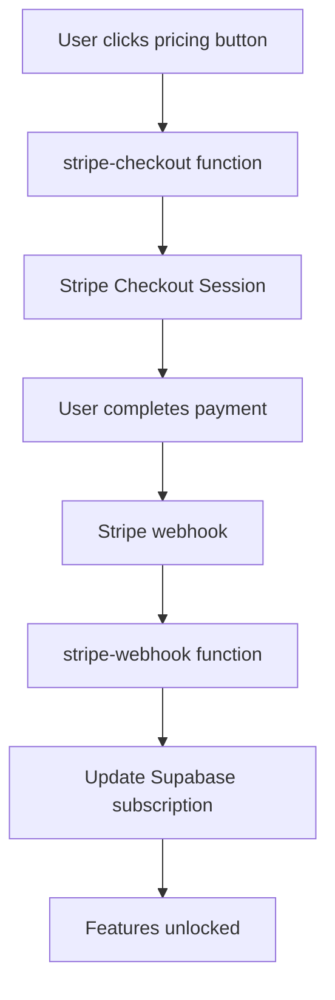

# Stripe Integration Documentation

## Overview

This document provides comprehensive documentation for the Stripe billing integration implemented in the schwalbe project. The integration provides subscription-based billing with feature gating, automatic subscription management, and webhook handling.

## Table of Contents

1. [Architecture Overview](#architecture-overview)
2. [Setup Process](#setup-process)
3. [Components](#components)
4. [Testing](#testing)
5. [Production Deployment](#production-deployment)
6. [Troubleshooting](#troubleshooting)
7. [Maintenance](#maintenance)

## Architecture Overview



### Key Components

- **Frontend Pricing UI**: Displays plans and triggers checkout
- **stripe-checkout Function**: Creates Stripe checkout sessions
- **stripe-webhook Function**: Handles webhook events and updates database
- **Subscription Service**: Manages feature gating and entitlements
- **Database Schema**: Stores subscription and usage data

## Setup Process

### Prerequisites

- Stripe CLI installed and authenticated
- Supabase CLI installed and authenticated
- jq installed for JSON processing
- Access to schwalbe Supabase project

### Automated Setup

The setup has been fully automated using scripts:

#### 1. Run Main Setup Script

```bash
./setup-stripe.sh
```

This script:
- Creates Stripe products (Basic Plan, Pro Plan)
- Creates pricing for both CZK and EUR currencies
- Sets STRIPE_SECRET_KEY in Supabase
- Provides instructions for webhook setup

#### 2. Run Webhook Setup Script

```bash
./setup-webhook.sh
```

This script:
- Creates webhook endpoint in Stripe
- Sets STRIPE_WEBHOOK_SECRET in Supabase
- Configures all required webhook events

#### 3. View Setup Summary

```bash
./stripe-setup-summary.sh
```

### Manual Setup (if needed)

<details>
<summary>Click to expand manual setup steps</summary>

#### 1. Create Stripe Products

```bash
# Basic Plan
stripe products create --name="Basic Plan" --description="Essential features for personal use"

# Pro Plan  
stripe products create --name="Pro Plan" --description="Advanced features for power users"
```

#### 2. Create Prices

```bash
# Basic Plan Prices
stripe prices create --product="BASIC_PRODUCT_ID" --unit-amount=29900 --currency=czk --recurring.interval=month
stripe prices create --product="BASIC_PRODUCT_ID" --unit-amount=1290 --currency=eur --recurring.interval=month

# Pro Plan Prices
stripe prices create --product="PRO_PRODUCT_ID" --unit-amount=79900 --currency=czk --recurring.interval=month
stripe prices create --product="PRO_PRODUCT_ID" --unit-amount=3490 --currency=eur --recurring.interval=month
```

#### 3. Create Webhook

```bash
stripe webhook_endpoints create \
  --url="https://rnmqtqaegqpbpytqawpg.supabase.co/functions/v1/stripe-webhook" \
  --enabled-events="checkout.session.completed" \
  --enabled-events="customer.subscription.created" \
  --enabled-events="customer.subscription.updated" \
  --enabled-events="customer.subscription.deleted" \
  --enabled-events="invoice.payment_succeeded" \
  --enabled-events="invoice.payment_failed"
```

#### 4. Set Supabase Secrets

```bash
supabase secrets set STRIPE_SECRET_KEY="sk_test_..." --project-ref rnmqtqaegqpbpytqawpg
supabase secrets set STRIPE_WEBHOOK_SECRET="whsec_..." --project-ref rnmqtqaegqpbpytqawpg
```

</details>

## Components

### 1. Stripe Checkout Function

**Location**: `/supabase/functions/stripe-checkout/index.ts`

**Purpose**: Creates Stripe checkout sessions for subscription purchases

**Features**:
- Domain-based currency detection (CZK for .cz domains, EUR for others)
- Dynamic pricing embedded in function
- Customer management (creates if doesn't exist)
- Proper success/cancel URL handling

**API Endpoint**: `POST /functions/v1/stripe-checkout`

**Request Body**:
```json
{
  "plan": "basic" | "pro"
}
```

**Response**:
```json
{
  "url": "https://checkout.stripe.com/..."
}
```

### 2. Stripe Webhook Function

**Location**: `/supabase/functions/stripe-webhook/index.ts`

**Purpose**: Handles Stripe webhook events and updates database

**Features**:
- Webhook signature verification
- Idempotent event processing
- Automatic subscription status updates
- Usage limit resets on billing periods
- Comprehensive error handling and logging

**Supported Events**:
- `checkout.session.completed`
- `customer.subscription.created`
- `customer.subscription.updated`
- `customer.subscription.deleted`
- `invoice.payment_succeeded`
- `invoice.payment_failed`

### 3. Subscription Service

**Location**: `/packages/shared/src/services/subscription.service.ts`

**Purpose**: Provides subscription management and feature gating

**Key Functions**:
- `getPlan(userId)`: Gets current user plan
- `hasEntitlement(feature, userId)`: Checks if user has access to feature
- `getUsage(userId)`: Gets current usage statistics
- `incrementUsage(userId, feature)`: Tracks feature usage

**Supported Features**:
- `ocr`: Document OCR processing
- `share`: Document sharing
- `export`: Document export

### 4. Database Schema

**Tables**:
- `user_subscriptions`: Stores subscription data
- `user_usage`: Tracks feature usage
- `subscription_limits`: Defines plan limits
- `subscription_preferences`: User preferences

**Key Columns**:
```sql
-- user_subscriptions
id, user_id, plan_name, status, stripe_customer_id, stripe_subscription_id, current_period_end

-- user_usage  
id, user_id, feature_name, usage_count, period_start, period_end
```

### 5. Pricing UI

**Location**: `/apps/web/src/components/landing/PricingSection.tsx`

**Features**:
- Localized pricing display
- Feature comparison
- Direct integration with checkout function
- Responsive design

## Testing

### Test Cards

Use these Stripe test cards:

| Card Number | Description |
|-------------|-------------|
| `4242424242424242` | Successful payment |
| `4000000000000002` | Declined payment |
| `4000000000009995` | Insufficient funds |

### Test Scenarios

#### 1. Frontend Integration Test

```bash
# 1. Visit staging app
# 2. Click "Upgrade to Basic" or "Upgrade to Pro"
# 3. Should redirect to Stripe Checkout
# 4. Complete payment with test card
# 5. Should redirect back to success page
```

#### 2. Webhook Processing Test

```bash
# After completing checkout:
# 1. Check Supabase function logs
# 2. Verify subscription created in database
# 3. Test feature access (OCR upload should work)
```

#### 3. Feature Gating Test

```bash
# Before subscription:
curl -X POST "your-app/api/ocr-upload" # Should return 402 Payment Required

# After subscription:
curl -X POST "your-app/api/ocr-upload" # Should process request
```

### Monitoring

#### Supabase Logs

```bash
# View function logs
supabase functions log stripe-checkout --project-ref rnmqtqaegqpbpytqawpg
supabase functions log stripe-webhook --project-ref rnmqtqaegqpbpytqawpg
```

#### Stripe Dashboard

- **Payments**: https://dashboard.stripe.com/payments
- **Subscriptions**: https://dashboard.stripe.com/subscriptions  
- **Webhooks**: https://dashboard.stripe.com/webhooks
- **Logs**: https://dashboard.stripe.com/logs

## Production Deployment

### Environment Configuration

1. **Switch to Live Mode**:
   ```bash
   stripe login --live
   ```

2. **Update Webhook URLs**:
   - Update webhook endpoint to production domain
   - Generate new webhook secret

3. **Set Live Secrets**:
   ```bash
   supabase secrets set STRIPE_SECRET_KEY="sk_live_..." --project-ref PROD_PROJECT_ID
   supabase secrets set STRIPE_WEBHOOK_SECRET="whsec_..." --project-ref PROD_PROJECT_ID
   ```

### Deployment Checklist

- [ ] Live Stripe keys configured
- [ ] Production webhook endpoint created
- [ ] Secrets updated in production Supabase
- [ ] Functions deployed to production
- [ ] Database migrations applied
- [ ] End-to-end testing completed
- [ ] Monitoring alerts configured

## Troubleshooting

### Common Issues

#### 1. Webhook Signature Verification Failed

**Symptoms**: Webhook events return 401 or signature errors

**Solutions**:
- Verify `STRIPE_WEBHOOK_SECRET` is correct
- Check webhook endpoint URL matches exactly
- Ensure webhook is configured for correct environment (test/live)

#### 2. Checkout Session Creation Failed

**Symptoms**: Checkout button doesn't work or returns errors

**Solutions**:
- Verify `STRIPE_SECRET_KEY` is set correctly
- Check product/price IDs exist in Stripe
- Verify user authentication is working

#### 3. Features Not Unlocking

**Symptoms**: User pays but features remain locked

**Solutions**:
- Check webhook processing logs
- Verify subscription record was created
- Test `hasEntitlement()` function directly
- Check database subscription status

### Debug Commands

```bash
# Check secrets are set
supabase secrets list --project-ref rnmqtqaegqpbpytqawpg

# Test webhook endpoint
curl -X POST "https://rnmqtqaegqpbpytqawpg.supabase.co/functions/v1/stripe-webhook" \
  -H "stripe-signature: test" \
  -H "authorization: Bearer TOKEN"

# View recent function logs
supabase functions log stripe-webhook --project-ref rnmqtqaegqpbpytqawpg | head -20
```

## Maintenance

### Regular Tasks

1. **Monitor Failed Payments**:
   - Check Stripe dashboard for failed invoices
   - Follow up with customers for payment method updates

2. **Update Prices** (when needed):
   - Create new prices in Stripe
   - Update frontend pricing display
   - Grandfather existing customers if needed

3. **Review Webhook Logs**:
   - Monitor for processing errors
   - Ensure all events are handled correctly

### Security Best Practices

- Rotate webhook secrets periodically
- Monitor for unusual payment patterns
- Keep Stripe SDK dependencies updated
- Regular security audits of payment flow

### Scaling Considerations

- Monitor function execution time
- Consider caching subscription data
- Implement proper error retry logic
- Plan for high-volume webhook processing

---

## Support

For issues with this integration:

1. Check the troubleshooting section above
2. Review Supabase function logs
3. Check Stripe dashboard for payment/webhook issues
4. Consult Stripe API documentation: https://stripe.com/docs/api

## References

- [Stripe API Documentation](https://stripe.com/docs/api)
- [Supabase Edge Functions](https://supabase.com/docs/guides/functions)
- [Stripe Webhooks Guide](https://stripe.com/docs/webhooks)
- [Stripe Testing Guide](https://stripe.com/docs/testing)