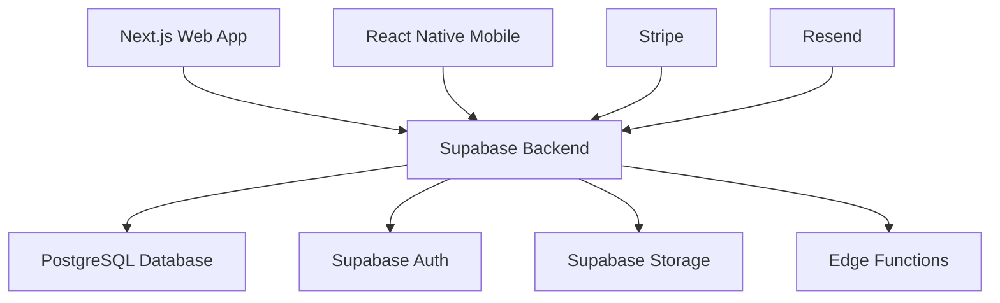

# 📋 Schwalbe Project Overview

## Project Summary

**Schwalbe** is a comprehensive digital estate planning platform that helps users create, manage, and protect their legal documents and digital legacy. The platform provides secure will creation, document management, family communication tools, and emergency access systems.

## Core Components

### 🏗️ Architecture

- **Frontend**: Next.js (App Router) web application
- **Mobile**: React Native apps for iOS/Android
- **Backend**: Supabase (PostgreSQL, Auth, Storage, Edge Functions)
- **Payments**: Stripe integration
- **Deployment**: Vercel (web), EAS (mobile)

### 🎯 Key Features

- **Will Creation Wizard**: Guided legal document creation with multi-language support
- **Document Management**: OCR-powered document upload and organization
- **Family Shield**: Secure sharing and emergency access systems
- **AI Assistant (Sofia)**: Contextual guidance and support
- **Professional Network**: Integration with legal professionals

### 🌍 International Support

- **39 Countries**: Dedicated domains and legal frameworks
- **34 Languages**: Full i18n support with country-specific content
- **Legal Compliance**: Jurisdiction-aware document generation

## Technology Stack

## Development Status

### Current Phase: Implementation & Stabilization

- ✅ Core authentication and user management
- ✅ Basic will creation workflow
- ✅ Document upload and OCR
- ✅ Payment integration
- 🔄 Mobile app development
- 🔄 Advanced AI features
- 📋 Production readiness and security hardening

## Team & Governance

- **Architecture**: Monorepo structure with shared packages
- **Quality**: Comprehensive testing, security audits, accessibility compliance
- **Documentation**: This knowledge base + traditional docs in `/docs`
- **CI/CD**: Automated testing, deployment, and monitoring

## Key Metrics

- **Users**: Growing user base across European markets
- **Compliance**: GDPR compliant with audit trails
- **Performance**: Optimized for global distribution
- **Security**: End-to-end encryption, RLS policies

## Related Documents

- [[01-Architecture/System Overview|Detailed Architecture]]
- [[05-Product/Roadmaps/Current Roadmap|Product Roadmap]]
- [[04-Operations/Security/Security Overview|Security Guidelines]]
- [[02-Development/Getting Started|Developer Onboarding]]

---

Last updated: {{date}}
