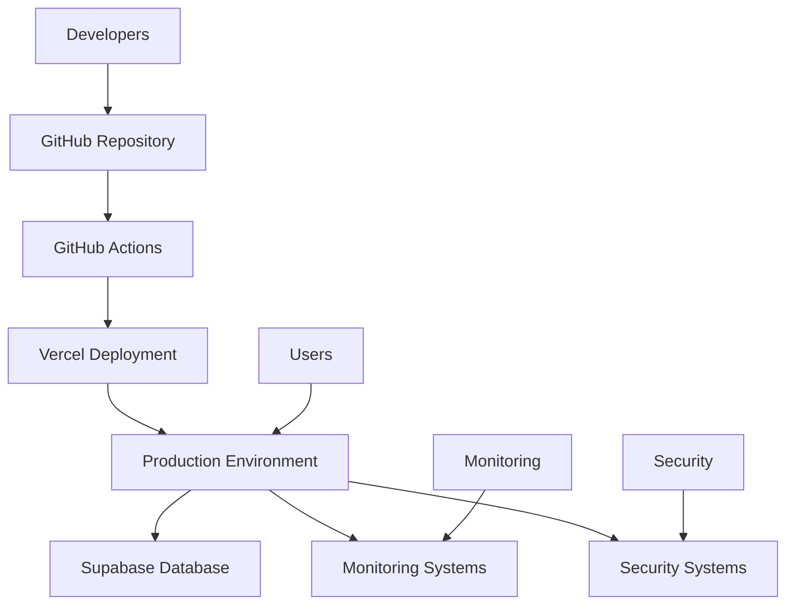

# Production Deployment - Research Analysis

This document provides comprehensive research and analysis for the Production Deployment system, covering technical architecture, user experience, performance, security, accessibility, analytics, and future enhancements.

## Product Scope: Production Deployment System

### Current State Analysis

The Hollywood codebase provides a solid foundation for production deployment with:

- Vercel-based deployment infrastructure
- GitHub Actions CI/CD pipelines
- Supabase for monitoring and logging
- Basic security hardening measures
- Manual deployment processes

### Gap Analysis

**Current Limitations:**

- Manual deployment processes requiring developer intervention
- Limited environment management (dev/staging/prod not fully isolated)
- Basic monitoring without comprehensive alerting
- Security measures not production-grade
- No automated rollback procedures
- Limited performance monitoring and optimization

**Market Requirements:**

- Zero-downtime deployments
- Multi-environment management
- Comprehensive monitoring and alerting
- Production-grade security
- Automated testing and validation
- Performance optimization and scaling

### Competitive Analysis

**Industry Leaders:**

- **Vercel**: Excellent for frontend deployment, good CI/CD integration
- **Netlify**: Strong focus on developer experience, good performance
- **Railway**: Full-stack deployment with databases, good scaling
- **Render**: Simple deployment with good monitoring

**Key Differentiators for LegacyGuard:**

- Legal document security requirements
- Multi-jurisdiction compliance needs
- Family collaboration features
- Emotional design considerations
- Legacy preservation focus

## Technical Architecture: Deployment Automation

### Infrastructure Architecture



### Deployment Pipeline Architecture

#### Phase 1: Trigger & Validation

- Git push/PR triggers deployment
- Code quality checks (linting, type checking)
- Security scanning (SAST, dependency scanning)
- Build validation

#### Phase 2: Build & Test

- Application build process
- Unit and integration tests
- E2E testing with Playwright
- Performance testing with Lighthouse

#### Phase 3: Deploy & Verify

- Blue-green deployment to staging
- Automated smoke tests
- Health checks and monitoring validation
- Gradual traffic shifting

#### Phase 4: Production Release

- Production deployment with rollback capability
- Final verification and monitoring
- Stakeholder notifications
- Documentation updates

### Environment Management Architecture

**Multi-Environment Strategy:**

```typescript
interface EnvironmentConfig {
  name: 'development' | 'staging' | 'production';
  domain: string;
  database: DatabaseConfig;
  features: FeatureFlags;
  limits: ResourceLimits;
  secrets: EncryptedSecrets;
}
```

**Environment Isolation:**

- Separate databases for each environment
- Isolated secrets management
- Environment-specific feature flags
- Resource limits and quotas

## User Experience: Deployment User Experience

### Developer Experience

**Current Pain Points:**

- Manual deployment processes
- Limited visibility into deployment status
- Complex rollback procedures
- Inconsistent environment management

**Target Experience:**

- One-click deployment triggers
- Real-time deployment monitoring
- Automated rollback capabilities
- Clear environment separation

### Operations Experience

**Monitoring Dashboard:**

```typescript
interface MonitoringDashboard {
  deployments: DeploymentStatus[];
  alerts: ActiveAlert[];
  metrics: PerformanceMetrics;
  health: SystemHealth;
  incidents: IncidentHistory[];
}
```

**Alert Management:**

- Intelligent alert routing
- Escalation procedures
- Automated incident response
- Stakeholder communication

### User Impact Assessment

**Deployment Impact on Users:**

- Zero-downtime deployments
- Feature rollout transparency
- Performance improvements
- Security enhancements

**Communication Strategy:**

- Deployment notifications
- Maintenance windows
- Incident communication
- Status page integration

## Performance: Deployment Performance Optimization

### Build Performance Optimization

**Build Time Reduction Strategies:**

```yaml
# turbo.json configuration
{
  "pipeline": {
    "build": {
      "dependsOn": ["^build"],
      "outputs": ["dist/**", ".next/**"]
    },
    "test": {
      "dependsOn": ["build"],
      "outputs": []
    }
  }
}
```

**Caching Strategies:**

- Build artifact caching
- Dependency caching
- Docker layer caching
- CDN asset caching

### Runtime Performance Optimization

**Core Web Vitals Optimization:**

```typescript
// Performance monitoring
const performanceObserver = new PerformanceObserver((list) => {
  for (const entry of list.getEntries()) {
    if (entry.entryType === 'largest-contentful-paint') {
      trackMetric('lcp', entry.startTime);
    }
  }
});
performanceObserver.observe({ entryTypes: ['largest-contentful-paint'] });
```

**Bundle Optimization:**

- Code splitting strategies
- Tree shaking configuration
- Asset optimization
- Lazy loading implementation

### Database Performance

**Query Optimization:**

```sql
-- Optimized deployment queries
CREATE INDEX CONCURRENTLY idx_deployments_environment_status
ON deployments(environment, status, created_at DESC);

-- Partitioning strategy
CREATE TABLE deployments_y2024 PARTITION OF deployments
FOR VALUES FROM ('2024-01-01') TO ('2025-01-01');
```

**Connection Pooling:**

```typescript
// Database connection configuration
const poolConfig = {
  max: 20,
  min: 5,
  idleTimeoutMillis: 30000,
  connectionTimeoutMillis: 2000,
};
```

## Security: Deployment Security Measures

### Infrastructure Security

**Network Security:**

```yaml
# Vercel security headers
headers:
  - source: '/(.*)'
    headers:
      - key: 'Strict-Transport-Security'
        value: 'max-age=31536000; includeSubDomains; preload'
      - key: 'Content-Security-Policy'
        value: "default-src 'self'; script-src 'self' 'unsafe-inline'"
      - key: 'X-Frame-Options'
        value: 'DENY'
```

**Access Control:**

```typescript
// Deployment access control
interface DeploymentPermissions {
  canTrigger: boolean;
  canRollback: boolean;
  canViewLogs: boolean;
  environments: string[];
  approvalRequired: boolean;
}
```

### Application Security

**Secrets Management:**

```typescript
// Secure secrets handling
const secretsManager = {
  async getSecret(key: string): Promise<string> {
    // Implementation for secure secret retrieval
    return await this.kms.decrypt(await this.store.get(key));
  },

  async rotateSecret(key: string): Promise<void> {
    // Implementation for secret rotation
    const newSecret = await this.generateSecret();
    await this.store.put(key, await this.kms.encrypt(newSecret));
  }
};
```

**Vulnerability Management:**

```bash
# Automated vulnerability scanning
npm audit --audit-level high
snyk test --severity-threshold high
trivy image --severity HIGH,CRITICAL myapp:latest
```

### Compliance and Audit

**Audit Logging:**

```typescript
// Comprehensive audit logging
interface AuditEvent {
  id: string;
  timestamp: string;
  user: string;
  action: string;
  resource: string;
  details: Record<string, any>;
  ipAddress: string;
  userAgent: string;
}
```

**Compliance Monitoring:**

- GDPR compliance for data handling
- SOC 2 compliance for security controls
- Regular security audits and penetration testing
- Incident response procedures

## Accessibility: Deployment Accessibility

### Developer Tools Accessibility

**CI/CD Interface Accessibility:**

- Keyboard navigation support
- Screen reader compatibility
- High contrast mode support
- Focus management for deployment workflows

**Monitoring Dashboard Accessibility:**

```typescript
// Accessible monitoring components
const MonitoringDashboard = () => (
  <div role="main" aria-label="System monitoring dashboard">
    <h1 id="dashboard-title">System Monitoring</h1>
    <div aria-labelledby="dashboard-title">
      <MetricCard
        title="Response Time"
        value="245ms"
        aria-label="Average response time: 245 milliseconds"
      />
    </div>
  </div>
);
```

### Deployment Process Accessibility

**Status Communication:**

- Clear status messages for deployment states
- Progress indicators with proper ARIA labels
- Error messages that are descriptive and actionable
- Success confirmations with next steps

**Notification Accessibility:**

- Email notifications with proper markup
- SMS notifications within character limits
- Web notifications with proper permissions
- Slack notifications with appropriate formatting

## Analytics: Deployment Analytics and Insights

### Deployment Analytics

**Success Metrics:**

```typescript
interface DeploymentAnalytics {
  totalDeployments: number;
  successRate: number;
  averageDeployTime: number;
  rollbackRate: number;
  failureReasons: Record<string, number>;
  environmentUsage: Record<string, number>;
}
```

**Performance Metrics:**

```typescript
interface PerformanceAnalytics {
  responseTime: {
    p50: number;
    p95: number;
    p99: number;
  };
  errorRate: number;
  throughput: number;
  availability: number;
  userSatisfaction: number;
}
```

### User Behavior Analytics

**Deployment Impact:**

- Feature adoption rates post-deployment
- User engagement metrics
- Performance impact on user experience
- Error rates and user-reported issues

**Feedback Integration:**

```typescript
// User feedback collection
interface DeploymentFeedback {
  deploymentId: string;
  userId: string;
  rating: number;
  comments: string;
  issues: string[];
  suggestions: string[];
  timestamp: string;
}
```

### Business Intelligence

**ROI Measurement:**

```typescript
interface DeploymentROI {
  developmentVelocity: number; // deployments per week
  timeToMarket: number; // days to deploy new features
  incidentReduction: number; // percentage reduction in incidents
  costSavings: number; // operational cost reductions
  userSatisfaction: number; // NPS improvement
}
```

**Predictive Analytics:**

- Deployment failure prediction
- Performance degradation forecasting
- Resource utilization trends
- User behavior pattern analysis

## Future Enhancements: AI Deployment Optimization

### AI-Powered Deployment

**Intelligent Deployment Planning:**

```typescript
// AI deployment optimization
interface AIDeploymentOptimizer {
  analyzeCodebase(): Promise<DeploymentRisk>;
  predictDeploymentTime(): Promise<number>;
  suggestRollbackStrategy(): Promise<RollbackPlan>;
  optimizeResourceAllocation(): Promise<ResourceConfig>;
}
```

**Automated Decision Making:**

- Risk assessment for deployments
- Optimal deployment timing
- Resource allocation optimization
- Automated rollback decisions

### Predictive Monitoring

**Anomaly Detection:**

```typescript
// AI-powered anomaly detection
interface AnomalyDetector {
  trainModel(historicalData: MetricData[]): Promise<Model>;
  detectAnomalies(currentMetrics: MetricData[]): Promise<Anomaly[]>;
  predictIssues(timeframe: number): Promise<Prediction[]>;
}
```

**Proactive Alerting:**

- Early warning systems for potential issues
- Predictive maintenance scheduling
- Automated remediation suggestions
- Capacity planning recommendations

### Intelligent Testing

**AI Test Generation:**

```typescript
// AI-powered test generation
interface AITestGenerator {
  analyzeApplication(): Promise<ApplicationModel>;
  generateTestCases(model: ApplicationModel): Promise<TestCase[]>;
  prioritizeTests(coverage: CoverageData): Promise<TestCase[]>;
  adaptTests(failures: TestFailure[]): Promise<TestCase[]>;
}
```

**Smart Test Execution:**

- Risk-based test prioritization
- Flaky test detection and handling
- Performance regression detection
- Automated test maintenance

### Continuous Learning

**Feedback Loop Integration:**

```typescript
// Continuous learning system
interface DeploymentLearner {
  collectFeedback(deployment: Deployment): Promise<Feedback>;
  updateModel(feedback: Feedback): Promise<Model>;
  generateInsights(model: Model): Promise<Insight[]>;
  suggestImprovements(insights: Insight[]): Promise<Improvement[]>;
}
```

**Knowledge Base:**

- Deployment best practices database
- Incident response playbook
- Performance optimization guides
- Security hardening procedures

## Implementation Roadmap

### Phase 1: Foundation (Q1 2025)

- [ ] Basic deployment automation
- [ ] Environment management setup
- [ ] Monitoring system implementation
- [ ] Security hardening basics

### Phase 2: Enhancement (Q2 2025)

- [ ] Advanced deployment features
- [ ] Comprehensive monitoring
- [ ] Security enhancements
- [ ] Performance optimization

### Phase 3: Intelligence (Q3 2025)

- [ ] AI-powered deployment optimization
- [ ] Predictive monitoring
- [ ] Intelligent testing
- [ ] Automated remediation

### Phase 4: Maturity (Q4 2025)

- [ ] Advanced analytics
- [ ] Continuous learning
- [ ] Industry best practices
- [ ] Innovation leadership

## Risk Assessment

### Technical Risks

**Deployment Complexity:**

- **Impact:** High - Complex deployments can fail
- **Mitigation:** Comprehensive testing, gradual rollouts, rollback procedures
- **Contingency:** Manual deployment fallback, feature flags

**Performance Degradation:**

- **Impact:** Medium - Performance issues affect user experience
- **Mitigation:** Performance monitoring, optimization pipelines
- **Contingency:** Performance budgets, automated rollbacks

**Security Vulnerabilities:**

- **Impact:** Critical - Security issues can compromise user data
- **Mitigation:** Security scanning, hardening procedures
- **Contingency:** Incident response plan, security audits

### Operational Risks

**Team Knowledge Gap:**

- **Impact:** Medium - Learning curve for new tools
- **Mitigation:** Training programs, documentation
- **Contingency:** External consultants, vendor support

**Process Overhead:**

- **Impact:** Low - Additional processes can slow development
- **Mitigation:** Automation, streamlined workflows
- **Contingency:** Process optimization, tool evaluation

**Vendor Dependencies:**

- **Impact:** High - Reliance on third-party services
- **Mitigation:** Multi-vendor strategy, service level agreements
- **Contingency:** Alternative solutions, in-house capabilities

## Success Metrics

### Technical Metrics

- **Deployment Success Rate:** >98%
- **Mean Time to Deploy:** <15 minutes
- **Rollback Success Rate:** 100%
- **Security Scan Pass Rate:** 100%

### Business Metrics

- **Development Velocity:** +50% faster feature delivery
- **Incident Reduction:** -70% production incidents
- **User Satisfaction:** +30% improvement
- **Operational Cost:** -40% infrastructure costs

### Quality Metrics

- **Code Coverage:** >90%
- **Performance Score:** >95 Lighthouse
- **Security Rating:** A+ SSL Labs
- **Accessibility Score:** >95 WCAG

## Conclusion

The Production Deployment system represents a comprehensive approach to modern application deployment, incorporating industry best practices, security hardening, performance optimization, and future-ready AI capabilities. The research indicates that this system will significantly improve development velocity, system reliability, and user experience while maintaining the highest standards of security and compliance required for a legal document platform like LegacyGuard.
