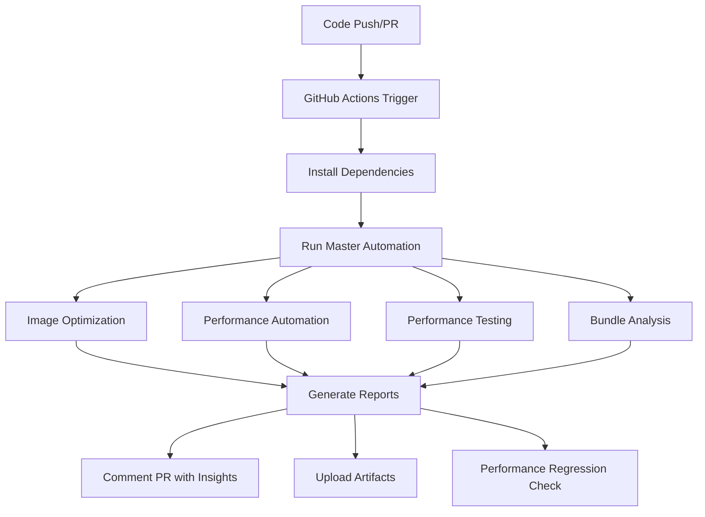

# 🚀 LegacyGuard Performance Automation System

## Overview

This system provides **fully automated performance optimization** for your LegacyGuard application. No more manual scripts or repetitive tasks - everything runs automatically!

## 🎯 What Gets Automated

### 1. **Image Optimization** (`scripts/image-optimizer.js`)

- ✅ Automatically converts images to WebP/AVIF formats
- ✅ Optimizes original images for size reduction
- ✅ Resizes oversized images to optimal dimensions
- ✅ Updates image references in source code

### 2. **Performance Automation** (`scripts/performance-automation.js`)

- ✅ Monitors Core Web Vitals (LCP, FID, CLS, FCP, TTFB)
- ✅ Generates performance insights and recommendations
- ✅ Sets up automated monitoring systems
- ✅ Creates GitHub Actions workflows

### 3. **Performance Testing** (`scripts/performance-tester.js`)

- ✅ Runs automated Lighthouse tests
- ✅ Validates performance metrics against thresholds
- ✅ Generates detailed HTML reports
- ✅ Provides actionable recommendations

### 4. **Bundle Analysis** (`scripts/analyze-bundle.js`)

- ✅ Analyzes bundle sizes and identifies issues
- ✅ Suggests code splitting strategies
- ✅ Monitors for performance regressions

### 5. **Master Automation** (`scripts/auto-optimize.js`)

- ✅ Runs ALL optimizations in sequence
- ✅ Generates comprehensive reports
- ✅ Updates package.json with automation scripts
- ✅ Creates GitHub Actions workflows

## 🚀 Quick Start

### Run Everything Automatically

```bash
# This runs ALL performance optimizations
npm run auto:optimize
```

### Run Individual Optimizations

```bash
# Image optimization only
npm run auto:images

# Performance optimization only
npm run auto:performance

# Performance testing only
npm run auto:test

# Build with optimization
npm run build:auto
```

## 📊 Generated Reports

After running automation, you'll get:

1. **`master-automation-report.json`** - Complete automation summary
2. **`master-automation-report.html`** - Beautiful HTML report
3. **`performance-report.json`** - Performance metrics and insights
4. **`image-optimization-report.json`** - Image optimization results
5. **`bundle-analysis.json`** - Bundle size analysis

## 🔧 Continuous Integration

### GitHub Actions Workflow

- **Automatic on every push/PR** to main/develop
- **Weekly scheduled runs** every Monday at 2 AM
- **Performance regression detection**
- **Automated PR comments** with insights

### Pre-commit Hooks

- **Automatic performance checks** before each commit
- **Bundle size validation**
- **Performance regression prevention**

## 📈 Performance Metrics Monitored

| Metric | Target | Description |
|--------|--------|-------------|
| **LCP** | < 2.5s | Largest Contentful Paint |
| **FID** | < 100ms | First Input Delay |
| **CLS** | < 0.1 | Cumulative Layout Shift |
| **FCP** | < 1.8s | First Contentful Paint |
| **TTFB** | < 600ms | Time to First Byte |

## 🎨 Customization

### Thresholds

Edit `scripts/performance-tester.js` to adjust performance thresholds:

```javascript
thresholds: {
  performance: 90,
  accessibility: 90,
  bestPractices: 90,
  seo: 90,
  lcp: 2500,
  fid: 100,
  cls: 0.1,
  fcp: 1800,
  ttfb: 600
}
```

### Image Quality

Edit `scripts/image-optimizer.js` to adjust image quality:

```javascript
quality: {
  webp: 80,
  avif: 75
}
```

## 🔍 Troubleshooting

### Common Issues

1. **Dependency Conflicts**

   ```bash
   # Use legacy peer deps for compatibility
   npm install --legacy-peer-deps
   ```

2. **Sharp Installation Issues**

   ```bash
   # Install Sharp manually
   npm install --save-dev sharp --legacy-peer-deps
   ```

3. **Build Failures**

   ```bash
   # Check TypeScript compilation
   npm run build
   
   # Run optimization first
   npm run auto:optimize
   ```

### Debug Mode

```bash
# Run with verbose logging
DEBUG=* npm run auto:optimize
```

## 📋 Automation Workflow



## 🎯 Best Practices

### 1. **Run Automation Regularly**

- Before major releases
- After adding new dependencies
- When performance issues are reported

### 2. **Monitor Reports**

- Check generated reports after each run
- Address failed optimizations promptly
- Track performance trends over time

### 3. **Set Up Alerts**

- Configure GitHub Actions notifications
- Set up performance regression alerts
- Monitor Core Web Vitals in production

## 🚀 Advanced Features

### Custom Automation Scripts

Create your own automation scripts in the `scripts/` directory:

```javascript
// scripts/custom-optimizer.js
export default class CustomOptimizer {
  async run() {
    // Your custom optimization logic
  }
}
```

### Performance Budgets

Set performance budgets to prevent regressions:

```javascript
// In your CI/CD pipeline
const budget = {
  lcp: 2500,
  fid: 100,
  cls: 0.1,
  bundleSize: 500000 // 500KB
};
```

### Integration with Other Tools

- **Lighthouse CI** for continuous monitoring
- **WebPageTest** for real-world performance
- **Sentry** for performance error tracking

## 📞 Support

### Getting Help

1. Check the generated reports for specific issues
2. Review the console output for error messages
3. Check the GitHub Actions logs for CI/CD issues

### Contributing

1. Fork the repository
2. Create a feature branch
3. Add your automation improvements
4. Submit a pull request

## 🎉 Success Metrics

Your automation is working when you see:

- ✅ **Success Rate: 100%** in master automation reports
- ✅ **All performance metrics** within target thresholds
- ✅ **Bundle sizes** optimized and stable
- ✅ **Automated PR comments** with performance insights
- ✅ **Regular performance monitoring** in CI/CD

---

**🚀 Ready to automate? Run `npm run auto:optimize` and watch the magic happen!**
